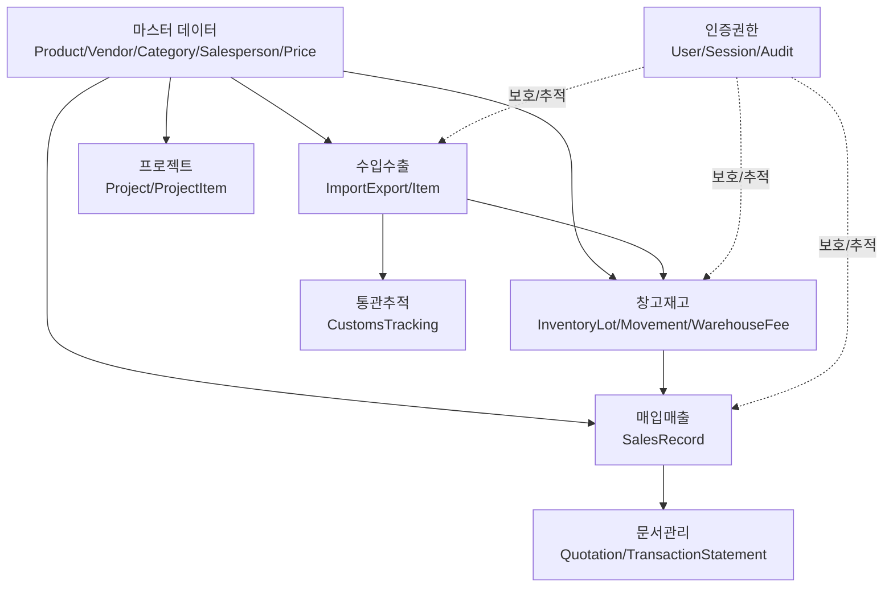
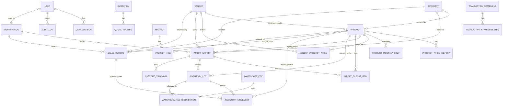
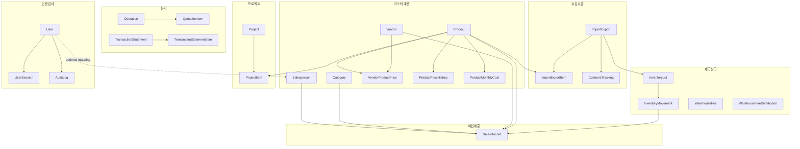

# 프로그램 구조/기능/DB 구조 분석 도식

이 문서는 **현재 코드베이스 기준**으로 다음을 정리합니다.
1) 프로그램 구조
2) 구현 가능한 기능(백엔드+DB 관점)
3) UI로 실제 노출된 기능
4) 기능별 DB 역할
5) 데이터베이스 관계 도식

---

## 1. 프로그램 구조

### 1-1. 전체 레이어 구조

```mermaid
flowchart LR
  U[사용자 브라우저] --> UI[Next.js App Router UI\n(app/*/page.tsx)]
  UI --> API[Next.js Route Handler API\n(app/api/**/route.ts)]
  API --> SVC[도메인 로직\n(원가/FIFO/문서생성/통관연동)]
  SVC --> ORM[Prisma Client]
  ORM --> DB[(PostgreSQL)]
  SVC --> FILE[파일 저장소\npublic/uploads 또는 NAS]
  SVC --> EXT[외부 시스템\nUNI-PASS API]
```

핵심은 **UI(App Router)** 와 **API(Route Handler)** 가 같은 Next.js 프로젝트 내부에서 동작하고, 데이터 저장은 Prisma를 통해 PostgreSQL로 처리하는 구조입니다.

### 1-2. 모듈 구조(도메인)



---

## 2. 데이터베이스 구조(테이블 연결)

### 2-1. 코어 ER 개념도



### 2-2. 관계를 실무 관점으로 풀어쓴 요약

- **마스터(Product/Vendor/Category/Salesperson)** 는 거의 모든 업무 테이블의 기준키 역할을 합니다.
- **ImportExport → InventoryLot** 흐름으로 수입 건이 재고 LOT 생성의 출발점이 됩니다.
- **InventoryMovement → SalesRecord** 연결로, 출고가 매출기록(원가/마진) 생성과 직접 연동됩니다.
- **VendorProductPrice / ProductPriceHistory / ProductMonthlyCost** 가 단가·원가 정책 계층을 구성합니다.
- **문서(견적/거래명세서)** 는 독립 문서 테이블이지만, 업무 데이터(매출/거래처)를 기반으로 생성될 수 있게 설계되어 있습니다.

---

## 3. 구현 가능한 기능(백엔드+DB 기준)

DB 스키마와 API 라우트 기준으로 구현 가능한 기능은 아래와 같습니다.

1. **인증/권한**: 사용자, 세션, 역할(ADMIN/STAFF), 상태(ACTIVE/DISABLED), 감사로그.
2. **마스터 관리**: 품목/거래처/카테고리/담당자/거래처별 특별가/가격이력.
3. **매입매출 관리**: 거래 등록·수정·조회, 원가·마진·부가세 계산, 매입-매출 링크.
4. **수입수출 관리**: 외화/환율/원화 환산, 다중 품목, 수입원가 항목, PDF 첨부.
5. **통관 추적**: BL/신고번호 기반 추적, 수입건 연동, 상태/세금/원본응답 저장.
6. **재고/창고**: LOT 입고, FIFO 출고, 입출고 이력, 창고료 월배분, 월별 원가 반영.
7. **프로젝트 관리**: 프로젝트 원가 항목/판매가/마진 관리, 품목(재료/부품/서비스/제품) 구성.
8. **문서관리**: 견적서/거래명세서 생성·항목 관리·합계 관리.
9. **환율/시스템설정**: 일자별 통화 환율 저장, 시스템 key-value 설정.

---

## 4. UI로 구현된 기능(사이드바/페이지 기준)

현재 UI 메뉴 기준으로 실제 노출된 기능은 다음과 같습니다.

- 대시보드
- 매입/매출: 상세내역, 흐름, 월/연 리포트
- 수입/수출: 내역, 등록, 통관 내역, 환율 관리
- 재고 관리: 입고, 출고, 재고 조회, 창고료 관리
- 프로젝트: 목록, 등록, 리포트
- 문서 관리: 문서 대시보드, 견적서, 거래명세서
- 설정: 거래처, 품목, 서비스, 카테고리, 담당자, 가격, 유니패스 설정, 엑셀 업로드

즉, **DB가 가진 핵심 도메인 대부분이 UI 메뉴에도 노출**되어 있고, 하위 호환 테이블(Item/SalesProduct 등)은 주로 내부 호환 용도로 보입니다.

---

## 5. “구현 가능 기능” vs “UI 기능” 차이

- DB에는 **인증(UserSession/AuditLog)**, **시스템설정(SystemSetting)**, **하위 호환 모델(Item/SalesProduct 계열)** 같은 운영/이행성 기능이 포함되어 있으나, 이 중 일부는 최상위 메뉴로 직접 보이지 않습니다.
- UI는 업무 사용자가 자주 쓰는 흐름(매입매출/수입수출/재고/프로젝트/문서/마스터)에 집중되어 있습니다.
- 따라서 “DB 가능 범위”가 “현재 UI 노출 범위”보다 약간 넓습니다.

---

## 6. 기능별 DB의 역할

### 6-1. 매입/매출
- `SalesRecord`가 거래의 본체(수량, 단가, 금액, 원가, 마진).
- `Product`, `Vendor`, `Category`, `Salesperson` FK로 분석축 형성.
- `InventoryMovement`와 연결되어 판매출고 기반 원가 계산을 추적.

### 6-2. 수입/수출
- `ImportExport`가 헤더(환율/외화/원화/원가 구성).
- `ImportExportItem`이 다중 품목 상세.
- 수입건은 이후 `InventoryLot` 생성의 근거 데이터가 됨.

### 6-3. 재고/창고
- `InventoryLot`이 재고 실체(입고수량/잔량/LOT원가).
- `InventoryMovement`가 입출고 이벤트 로그(FIFO 출고 포함).
- `WarehouseFee`/`WarehouseFeeDistribution`이 월 창고료를 LOT별로 배분.
- `ProductMonthlyCost`로 월단위 원가 스냅샷 관리.

### 6-4. 마스터/가격
- `VendorProductPrice`(거래처별 특별가), `ProductPriceHistory`(시계열 가격), `Product.currentCost/default*Price`(현재값)로 다층 가격 체계 구성.

### 6-5. 프로젝트
- `Project`가 손익 컨테이너, `ProjectItem`이 구성 항목.
- 품목 참조형(제품/재료/부품/서비스) + 직접입력형을 함께 지원.

### 6-6. 문서
- `Quotation(견적)` / `TransactionStatement(거래명세)`와 각 item 테이블이 문서 독립 저장소 역할.
- 출력(PDF/Excel) 시 이 테이블 데이터가 원본이 됨.

### 6-7. 통관/인증
- `CustomsTracking`이 UNI-PASS 조회 결과와 수입건 연결을 담당.
- `User/UserSession/AuditLog`가 접근 제어, 세션 관리, 행위 감사 담당.

---

## 7. 요청하신 “DB 구조 및 기능 도식화” (통합)



